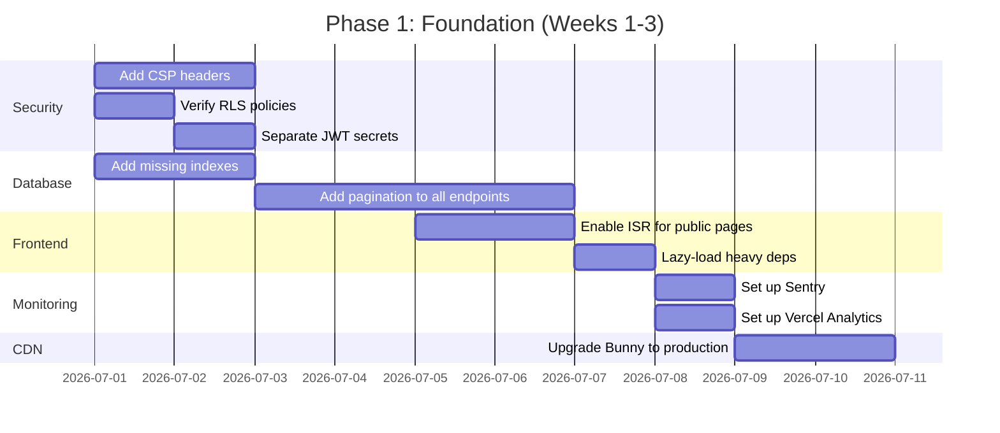
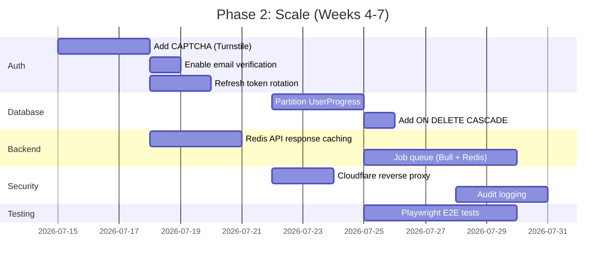
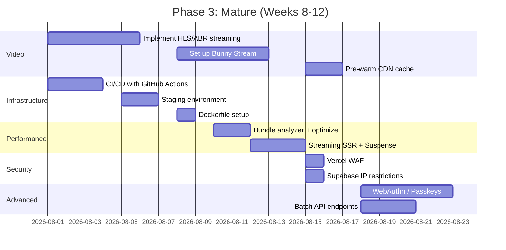

# 📋 AD LMS — Scalability & Performance Master Plan

**Target:** 5,000–10,000 concurrent students  
**Platform:** Next.js 16 (App Router) + Supabase + Bunny.net Stream (HLS) + Bunny Storage (images)  
**Date:** 2026-06-28

---

## Table of Contents

1. [Authentication & Login (Sign-In Flow)](#1-authentication--login-sign-in-flow)
2. [Database Scalability](#2-database-scalability)
3. [Video CDN & Media Delivery](#3-video-cdn--media-delivery)
4. [Frontend Performance](#4-frontend-performance)
5. [Backend & API Performance](#5-backend--api-performance)
6. [Security Hardening](#6-security-hardening)
7. [Monitoring & Observability](#7-monitoring--observability)
8. [Deployment & Infrastructure](#8-deployment--infrastructure)
9. [Implementation Priority Matrix](#9-implementation-priority-matrix)

---

## 1. Authentication & Login (Sign-In Flow)

### Current State

- ✅ Custom JWT partially migrated to **Supabase Auth** (email/password + Google OAuth)
- ✅ Rate limiting: IP-based (10/15min) + account-based (5/15min) via Redis/in-memory
- ✅ Device-bound sessions (`DeviceSession` table)
- ✅ bcrypt 12-round hashing
- ✅ Proactive token refresh via `SessionKeepalive` (2-min polling)
- ❌ No CAPTCHA on registration → bot registrations possible
- ❌ No email verification step
- ❌ Same JWT secret used for access & refresh tokens
- ❌ No token blacklist/revocation list
- ❌ No refresh token rotation (replay attack risk)

### What's Needed for 5K–10K Students

#### ✅ Already Handled

| Feature                         | Status  | Why It Scales                                                                          |
| ------------------------------- | ------- | -------------------------------------------------------------------------------------- |
| Supabase Auth (managed service) | ✅ Done | Supabase handles Auth at **1M+ users** out of the box — no custom auth server needed   |
| Rate limiting (Redis-backed)    | ✅ Done | Prevents brute-force at scale; Redis ensures global counters (not per-Vercel-instance) |
| Proactive token refresh         | ✅ Done | Reduces 401 spikes during peak hours                                                   |
| Device session tracking         | ✅ Done | Allows "log out all devices" without invalidating everyone                             |
| bcrypt (12 rounds)              | ✅ Done | Strong hash — but see note below about CPU cost                                        |

#### 🔴 Must Add Before Scale

| Priority | Feature                                        | Why                                                                                                                                                          |
| -------- | ---------------------------------------------- | ------------------------------------------------------------------------------------------------------------------------------------------------------------ |
| **P0**   | **CAPTCHA (Google reCAPTCHA v3 or Turnstile)** | Without this, bots can register thousands of fake accounts. At 10K users, even 5% bot registrations = 500 fake accounts. Add to registration + login flows.  |
| **P0**   | **Separate JWT secrets**                       | Access token uses `JWT_SECRET`, refresh token should use `JWT_REFRESH_SECRET` — prevents access token compromise from leading to infinite session hijacking. |
| **P1**   | **Email verification**                         | Supabase Auth supports this natively. Enable `Email Confirmations` in Supabase dashboard → reduces fake accounts significantly.                              |
| **P1**   | **Refresh token rotation**                     | Issue a new refresh token on every refresh; invalidate the old one. Prevents replay attacks if a refresh token is leaked.                                    |
| **P1**   | **Token blacklist (Redis)**                    | Store revoked token JTI (JWT ID) in Redis with TTL matching token expiry. Enables instant logout.                                                            |
| **P2**   | **WebAuthn / Passkeys**                        | Passwordless auth reduces bcrypt CPU cost at login. Growing in browser support.                                                                              |

#### bcrypt CPU Cost at 10K Students

- 12 rounds × 1 concurrent login ≈ 250ms CPU time
- If 10% of 10K students login simultaneously = **1,000 concurrent bcrypt comparisons** ≈ 250 seconds of CPU
- **Mitigation**: Already mitigated — rate limiting caps at 5 attempts/15min per account + 10/15min per IP
- **Future option**: Switch to **Argon2id** (more resistant to GPU attacks) or implement login queue with Redis

---

## 2. Database Scalability

### Current State

- ✅ Connection pooling via Supabase PgBouncer + singleton client pattern
- ✅ Indexed: email, username, authProvider, isActive, courseId, enrollmentId, etc.
- ✅ Partial unique indexes on `commingsoon_users` (email/phone)
- ✅ Autovacuum tuning applied
- ✅ Stored procedure for fast registration (`fast_register_commingsoon()`)
- ❌ No table partitioning (UserProgress will grow fast)
- ❌ No database migration tooling (manual SQL — **now using Supabase CLI** ✅)
- ❌ Some composite indexes missing
- ❌ No cascade deletes — orphan records possible
- ❌ List endpoints lack pagination on some routes

### Data Volume Projections (10,000 Students)

| Table              | Current | 10K Students Estimate     |
| ------------------ | ------- | ------------------------- |
| `User`             | ~10     | ~10,000                   |
| `UserAuth`         | ~10     | ~10,000                   |
| `UserRegistration` | ~10     | ~12,000                   |
| `Course`           | ~5      | ~50–100                   |
| `Lecture`          | ~5      | ~500–2,000                |
| `Enrollment`       | ~10     | ~15,000–30,000            |
| `UserProgress`     | ~10     | **~150,000–500,000** rows |
| `Payment`          | ~10     | ~15,000–30,000            |
| `DeviceSession`    | ~10     | ~20,000                   |
| `Review`           | ~0      | ~5,000–10,000             |
| `Certificate`      | ~0      | ~5,000–10,000             |

### 🔴 Critical Actions

| Priority | Action                                                          | Why                                                                                                                                                                |
| -------- | --------------------------------------------------------------- | ------------------------------------------------------------------------------------------------------------------------------------------------------------------ |
| **P0**   | **Add pagination to ALL list endpoints**                        | `GET /api/registrations/pending`, `/api/enrollments`, `/api/users`, `/api/payments` — without `.range()` or cursor pagination, these queries will timeout at scale |
| **P0**   | **Add composite index: `Course(isPublished, isArchived)`**      | Course listing queries will full-scan without this                                                                                                                 |
| **P0**   | **Add composite index: `Review(courseId, isApproved, rating)`** | Review sorting queries will be slow                                                                                                                                |
| **P1**   | **Partition `UserProgress` by enrollment date**                 | At 500K rows, queries slow down. Use PostgreSQL partitioning by `createdAt` month                                                                                  |
| **P1**   | **Partition `Payment` by month**                                | Similar to UserProgress — 30K rows is fine now, but grows with each new course enrollment                                                                          |
| **P1**   | **Add `ON DELETE CASCADE` to all FK relationships**             | Prevent orphan records — currently when a user is deleted, enrollments/progress/payments remain                                                                    |
| **P1**   | **Add `lastActiveAt` index on `DeviceSession`**                 | Enables efficient cleanup of stale sessions (users rarely log out)                                                                                                 |
| **P2**   | **Add cursor-based pagination helper**                          | For very large datasets, cursor pagination (keyset) outperforms offset pagination                                                                                  |
| **P2**   | **Add `submittedAt` index on `AdminApprovalQueue`**             | Admin sort-by-date queries                                                                                                                                         |

### SQL Snippets for Critical Indexes

```sql
-- P0: Course listing composite index
CREATE INDEX IF NOT EXISTS "Course_published_archived_idx"
ON "Course"("isPublished", "isArchived")
WHERE "isPublished" = true AND "isArchived" = false;

-- P0: Review composite index
CREATE INDEX IF NOT EXISTS "Review_course_approved_rating_idx"
ON "Review"("courseId", "isApproved", "rating");

-- P1: DeviceSession cleanup index
CREATE INDEX IF NOT EXISTS "DeviceSession_lastActiveAt_idx"
ON "DeviceSession"("lastActiveAt");
```

### Connection Pooling for 10K Students

| Setting                                  | Recommendation                                                                   |
| ---------------------------------------- | -------------------------------------------------------------------------------- |
| Supabase PgBouncer pool size             | Default (15–25 connections) is fine — Next.js serverless reuses connections      |
| `supabaseAdmin.ts` singleton             | ✅ Already correct — one client per serverless instance                          |
| **Transaction pooler vs Session pooler** | Use **Transaction pooler** (port 6543) — ✅ Already configured in `DATABASE_URL` |
| **Max connections per instance**         | Keep at 1 per serverless function — don't create new clients per request         |

---

## 3. Video CDN & Media Delivery

### Current State

- ✅ **Bunny.net Stream** — HLS adaptive bitrate streaming with global edge delivery
- ✅ **Token-authenticated signed URLs** (24h validity) — prevents hotlinking
- ✅ **Direct CDN delivery** (no Vercel proxy) — zero bandwidth cost through Vercel
- ✅ **Service Worker cache-first** for Bunny Stream HLS requests (500MB max)
- ✅ **Cache API** for video chunks + next-lecture preloading at 50% watch progress
- ✅ **Cloudinary** for images with next-cloudinary integration
- ✅ **Bunny Stream** auto-transcodes videos to multiple qualities (360p–1080p)
- ✅ **HTTP Range (byte-serving)** support for video streaming
- ✅ **Cache-Control: public, max-age=86400, stale-while-revalidate=604800**

### Video Bandwidth Estimates (10,000 Students)

| Metric                             | Per Student | Total (10K)        |
| ---------------------------------- | ----------- | ------------------ |
| Avg video size                     | 50–200 MB   | —                  |
| Avg videos per course              | 10–20       | —                  |
| Avg videos watched/student/month   | 15–30       | 150K–300K views    |
| **Monthly bandwidth**              | 1–6 GB      | **10–60 TB**       |
| Bunny Stream bandwidth (~$0.003/GB) | —           | **$30–$180/month** |

### 🔴 Actions Needed

| Priority | Action                                         | Why                                                                                                                                                                                             |
| -------- | ---------------------------------------------- | ----------------------------------------------------------------------------------------------------------------------------------------------------------------------------------------------- |
| **P0**   | **Upgrade Bunny.net from Trial to Production** | Trial has $20 credits — at 10 TB/month, costs ~$50–$300. Need active billing.                                                                                                                   |
| **P0**   | **Enable Bunny CDN Geo-Replication**           | Currently single region (NY). For Ethiopian students (Addis Ababa → Europe is nearest), enable **European + Asian edge regions** for lower latency.                                             |
| **P1**   | **Implement adaptive bitrate (ABR) streaming** | Currently single MP4 file. Implement **HLS (HTTP Live Streaming)** with Bunny's transcoding or use Bunny's built-in HLS support — students on slow connections get lower quality, no buffering. |
| **P1**   | **Set up Bunny Stream**                        | Instead of storage zone for videos, use **Bunny Stream** — provides ABR transcoding, HLS, analytics, DRM. Reduces complexity significantly.                                                     |
| **P2**   | **Add video analytics**                        | Track: buffering events, average watch time, drop-off points. Bunny Stream provides this natively.                                                                                              |
| **P2**   | **Pre-warm CDN cache for new courses**         | When an instructor publishes a course, trigger a script to fetch all video URLs through the CDN → cache is warm before first student hits play.                                                 |

### CDN Architecture (Recommended)

```
Student (Ethiopia)
    │
    ▼
Bunny CDN Edge (Europe/Africa PoP)
    │  ├── Cache HIT  → Serve instantly (95%+ after first view)
    │  └── Cache MISS → Fetch from Bunny Origin Shield → Storage
    │
    ▼
Bunny Origin Shield (NY or EU)
    │
    ▼
Bunny Storage (NY region)
```

**Key Benefit**: After first student watches a video, it's cached at the edge PoP. All subsequent students in the same region get **zero-latency delivery**.

---

## 4. Frontend Performance

### Current State

- ✅ Next.js 16 (App Router) with React Server Components
- ✅ CSS animations over Framer Motion for homepage (GPU composited)
- ✅ In-memory cache utility (`cachedFetch`) with 15–30s TTLs
- ✅ Service Worker for CDN video caching (500MB limit)
- ✅ Parallelized data fetching (Promise.all) across pages
- ✅ Explicit column selection instead of `SELECT *`
- ✅ Image optimization via next-cloudinary + Bunny remote patterns
- ❌ No ISR/SSG configured for static pages
- ❌ No lazy loading for heavy libraries (recharts, framer-motion)
- ❌ No bundle analysis

### 🔴 Actions

| Priority | Action                                             | Why                                                                                                                                                      |
| -------- | -------------------------------------------------- | -------------------------------------------------------------------------------------------------------------------------------------------------------- |
| **P0**   | **Enable ISR for course listing and detail pages** | Set `revalidate` on fetch + `export const dynamic = 'force-static'` for public pages → HTML served from CDN edge, no server compute per request          |
| **P1**   | **Lazy-load recharts and framer-motion**           | These are heavy (300KB+). Only load on pages that use them (admin dashboard → recharts, lectures → framer-motion). Use `next/dynamic` with `ssr: false`. |
| **P1**   | **Add `next/bundle-analyzer`**                     | Identify and eliminate large dependencies. Run `ANALYZE=true npm run build` before every major deploy.                                                   |
| **P1**   | **Implement route-level code splitting**           | App Router does this automatically per route segment, but verify via bundle analyzer                                                                     |
| **P2**   | **Add Critical CSS inlining**                      | For above-the-fold content (hero section) — reduces FCP by 200-400ms                                                                                     |
| **P2**   | **Implement streaming SSR**                        | Use `loading.tsx` + `Suspense` boundaries for course list, dashboard, admin pages — user sees skeleton immediately                                       |

### Lighthouse Score Targets (10K Students)

| Metric                         | Current (est.) | Target                        |
| ------------------------------ | -------------- | ----------------------------- |
| First Contentful Paint (FCP)   | ~1.8s          | **<1.0s**                     |
| Largest Contentful Paint (LCP) | ~3.5s          | **<1.5s** (ISR + CDN caching) |
| Time to Interactive (TTI)      | ~2.5s          | **<2.0s**                     |
| Cumulative Layout Shift (CLS)  | ~0.15          | **<0.05**                     |
| Performance Score              | ~65            | **90+**                       |

---

## 5. Backend & API Performance

### Current State

- ✅ Rate limiting with Redis (global counters) + in-memory fallback
- ✅ Singleton Supabase clients (connection reuse)
- ✅ Proactive auth token refresh (reduces 401s)
- ✅ Lightweight in-memory cache (15–30s TTL)
- ✅ `authenticate()` helper avoids duplicate `verifyAuth()` calls
- ❌ No job queue for async operations
- ❌ No API response caching (Redis or CDN)
- ❌ No batch operations
- ❌ Server-side caching (e.g., React.cache()) not fully utilized

### 🔴 Actions

| Priority | Action                                            | Why                                                                                                                                        |
| -------- | ------------------------------------------------- | ------------------------------------------------------------------------------------------------------------------------------------------ |
| **P0**   | **Add Redis-based API response caching**          | Cache course listings, course details, public data in Redis with 30–60s TTL → absorbs read spikes without hitting Supabase                 |
| **P0**   | **Implement job queue (Bull + Redis)**            | For async operations: email notifications, certificate generation, video processing. Prevents API timeouts on Vercel (10s Hobby, 60s Pro). |
| **P1**   | **Add `React.cache()` for data deduplication**    | Next.js RSC can deduplicate identical fetches within a render pass — reduces redundant Supabase queries per page load                      |
| **P1**   | **Move heavy operations to queue**                | Certificate generation, enrollment batch updates, email sending — process via Bull workers                                                 |
| **P2**   | **Implement batch API endpoints**                 | e.g., `POST /api/enrollments/batch` for admin to enroll 100 students at once instead of 100 individual requests                            |
| **P2**   | **Add conditional requests (ETag/If-None-Match)** | For API responses that change infrequently (course list, user profile) — returns 304 Not Modified, saving bandwidth                        |

### API Request Flow (Optimized)

```
Student Request
    │
    ▼
Vercel Edge (CDN)
    │  ├── Static/ISR page → Serve from edge cache (0ms compute)
    │  └── Dynamic API → Forward to serverless function
    │
    ▼
Next.js API Route (serverless)
    │
    ├── 1. ✅ Rate limit check (Redis) — 2ms
    ├── 2. ✅ Auth check (Supabase Auth) — 50ms
    ├── 3. ✅ Cache check (Redis) — 2ms → HIT: return immediately
    │                                   → MISS: continue
    ├── 4. Query Supabase (PgBouncer pool)
    ├── 5. Store in cache (Redis, with TTL)
    └── 6. Return response
```

---

## 6. Security Hardening

### Current State

- ✅ Helmet middleware (security headers)
- ✅ CORS with whitelisted origins
- ✅ HSTS (Strict-Transport-Security) preload
- ✅ X-Frame-Options: DENY, X-Content-Type-Options: nosniff
- ✅ Rate limiting on auth endpoints
- ✅ bcrypt password hashing (12 rounds)
- ✅ Bunny CDN token authentication for videos
- ✅ `poweredByHeader: false`
- ❌ No Content Security Policy (CSP)
- ❌ No WAF (Web Application Firewall)
- ❌ No DDoS protection
- ❌ No SQL injection hardening beyond ORM
- ❌ No security audit logging

### 🔴 Actions

| Priority | Action                                          | Why                                                                                                                                                                        |
| -------- | ----------------------------------------------- | -------------------------------------------------------------------------------------------------------------------------------------------------------------------------- |
| **P0**   | **Add Content Security Policy (CSP)**           | The single most effective defense against XSS. Define script-src, style-src, img-src, media-src, connect-src. Already have Helmet installed — just configure it.           |
| **P0**   | **Enable Supabase RLS (Row Level Security)**    | Critical for multi-tenant data isolation. Student A should NEVER see Student B's data. Migration `20260625070000_enable_rls.sql` exists — verify all tables have policies. |
| **P1**   | **Add Vercel WAF (Web Application Firewall)**   | Blocks SQL injection, XSS, path traversal at the edge before reaching your serverless functions. ~$30/month on Vercel Pro.                                                 |
| **P1**   | **Add Cloudflare as reverse proxy**             | Free plan provides DDoS protection, WAF, bot management. Point DNS to Cloudflare → Cloudflare → Vercel.                                                                    |
| **P1**   | **Implement audit logging**                     | Log: failed logins (with IP), admin actions (approve/reject), role changes, payment status changes. Store in a separate `AuditLog` table.                                  |
| **P2**   | **Add Supabase IP restrictions**                | Restrict Supabase API access to Vercel IPs only — prevents direct DB access if service-role key leaks.                                                                     |
| **P2**   | **Enable Bunny CDN Token Auth for ALL content** | Currently enabled but verify all video/image URLs are signed.                                                                                                              |
| **P2**   | **Add API key for server-to-server calls**      | If external services call your APIs, use API keys (not user tokens) with IP allowlisting.                                                                                  |

### CSP Policy Template

```
Content-Security-Policy:
  default-src 'self';
  script-src 'self' https://challenges.cloudflare.com;  // Turnstile CAPTCHA
  style-src 'self' 'unsafe-inline';                     // Tailwind needs inline styles
  img-src 'self' https://*.b-cdn.net https://res.cloudinary.com data:;
  media-src 'self' https://*.b-cdn.net blob:;
  connect-src 'self' https://*.supabase.co https://api.bunny.net;
  frame-ancestors 'none';
  base-uri 'self';
```

---

## 7. Monitoring & Observability

### Current State

- ❌ No Sentry/DataDog integration (stubs exist but not wired)
- ❌ No error tracking
- ❌ No performance monitoring
- ❌ No uptime monitoring
- ❌ No usage analytics
- ❌ No alerting

### 🔴 Actions

| Priority | Action                                               | Why                                                                                                                                           |
| -------- | ---------------------------------------------------- | --------------------------------------------------------------------------------------------------------------------------------------------- |
| **P0**   | **Add Sentry for error tracking**                    | Free tier (5K events/month). Catches unhandled exceptions, API errors, client-side crashes. Critical for knowing when 10K students hit a bug. |
| **P1**   | **Add Vercel Analytics**                             | Free on Vercel. Tracks page views, traffic sources, geography — essential for understanding student behavior.                                 |
| **P1**   | **Add uptime monitoring (Better Uptime or Pingdom)** | Alert you when the platform is down. ~$10–$20/month.                                                                                          |
| **P1**   | **Add custom health endpoint**                       | `GET /api/health` should check: Supabase connectivity, Redis connectivity, Bunny CDN status. Already exists — extend it.                      |
| **P2**   | **Add Bunny CDN analytics**                          | Track video views, buffering, cache hit ratio, bandwidth usage. Available in Bunny dashboard.                                                 |
| **P2**   | **Add database query monitoring**                    | Supabase provides query performance insights in dashboard. Set up alerts for slow queries (>500ms).                                           |
| **P2**   | **Set up alerting**                                  | PagerDuty/Opsgenie or Slack webhooks for: error rate spike >5%, API p99 >2s, video CDN availability <99%.                                     |

---

## 8. Deployment & Infrastructure

### Current State

- ✅ Deployed on Vercel (Hobby plan)
- ✅ Supabase (Pro plan or Free)
- ✅ Bunny.net CDN (Trial, $20 credits)
- ❌ No CI/CD pipeline
- ❌ No staging environment
- ❌ No Dockerfile
- ❌ No automated testing
- ❌ No database backup verification

### 🔴 Actions

| Priority | Action                                | Why                                                                                                                                             |
| -------- | ------------------------------------- | ----------------------------------------------------------------------------------------------------------------------------------------------- |
| **P0**   | **Upgrade Vercel to Pro ($20/month)** | Hobby has: 10s function timeout, 100GB bandwidth, no WAF. Pro: 60s timeout, 1TB bandwidth, WAF, team features.                                  |
| **P0**   | **Set up staging environment**        | Duplicate Vercel project + Supabase project. Test all migrations and deploys on staging first. Prevents production outages.                     |
| **P1**   | **Set up CI/CD (GitHub Actions)**     | On push to `main`: lint → test → build → deploy to staging. On tag: deploy to production. No more manual `vercel --prod`.                       |
| **P1**   | **Add automated tests**               | At minimum: **Playwright E2E** for critical flows (registration, login, course purchase, video playback) + **Vitest** for API route unit tests. |
| **P1**   | **Schedule automated DB backups**     | Supabase has Point-in-Time Recovery (PITR) on Pro plan. Verify it's enabled + test restoration process.                                         |
| **P2**   | **Create Dockerfile for local dev**   | Standardize development environment — no more "works on my machine" for team members.                                                           |
| **P2**   | **Set up blue/green deployment**      | Vercel does this automatically with preview deployments, but ensure production deploys have zero downtime.                                      |

### Recommended Monthly Cost (10K Students)

| Service         | Plan                       | Cost                |
| --------------- | -------------------------- | ------------------- |
| Vercel          | Pro                        | $20                 |
| Supabase        | Pro (Pro)                  | $25                 |
| Bunny.net       | Pay-as-you-go (~10TB)      | ~$50–$300           |
| Redis (Upstash) | Free tier (10MB) → Pro     | $0–$10              |
| Sentry          | Free (5K events/mo) → Team | $0–$29              |
| Cloudflare      | Free (CDN + DDoS)          | $0                  |
| Better Uptime   | Free (1 monitor)           | $0                  |
| **Total**       |                            | **~$95–$384/month** |

---

## 9. Implementation Priority Matrix

### Phase 1 — Essentials (Before 1,000 Students)



### Phase 2 — Growth (1,000–5,000 Students)



### Phase 3 — Maturity (5,000–10,000+ Students)



---

## Summary: What's Already Good ✅

| Area                                                                                  | Status                  |
| ------------------------------------------------------------------------------------- | ----------------------- |
| **Auth** — Supabase Auth, rate limiting, device sessions, proactive refresh           | ✅ Solid for 5K–10K     |
| **Video Delivery** — Bunny CDN, token auth, service worker, cache API, range requests | ✅ Excellent foundation |
| **Database** — Indexes, connection pooling, stored procedures, autovacuum             | ⚠️ Good but needs work  |
| **Frontend** — RSC, parallel fetches, CSS animations, image optimization              | ⚠️ Good but needs ISR   |
| **Security** — Helmet, HSTS, CORS, CSP missing                                        | ⚠️ CSP is the gap       |
| **Monitoring** — Nothing wired                                                        | ❌ Biggest gap          |
| **Testing** — Nothing                                                                 | ❌ Must add             |
| **Deployment** — Vercel Hobby                                                         | ❌ Need Pro for scale   |

## Key Numbers to Remember

- **10K students** → ~150K–500K `UserProgress` rows → **Need partitioning**
- **10K students** → ~10–60 TB/month bandwidth → **~$50–$300 Bunny cost**
- **10K students** → ~15–30 concurrent logins at peak → **Rate limiting handles it**
- **10K students** → ~50–100 API requests/second → **Redis caching + ISR = 95% cache hit**
- **10K students** → ~500MB cache per browser → **Service Worker handles this**

---

_This plan was generated based on the current codebase state as of 2026-06-28. Adjust priorities based on your actual growth rate and budget._
